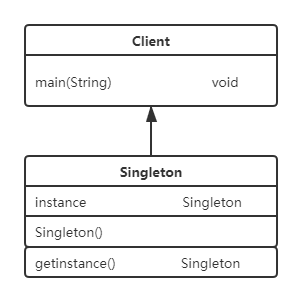
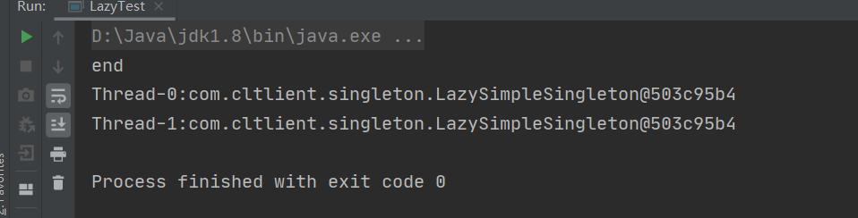
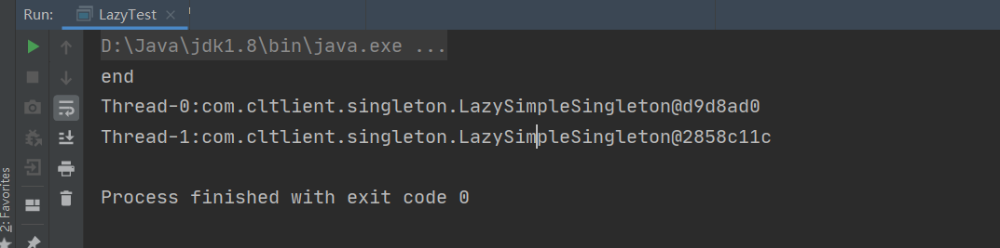
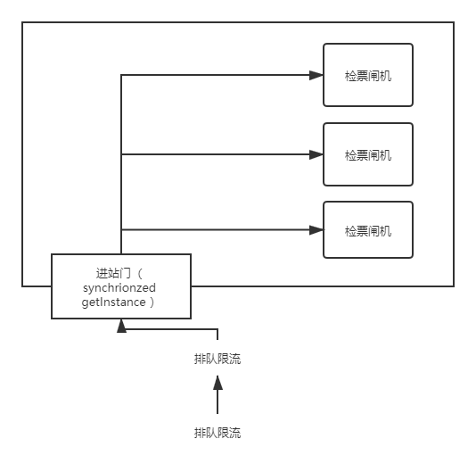
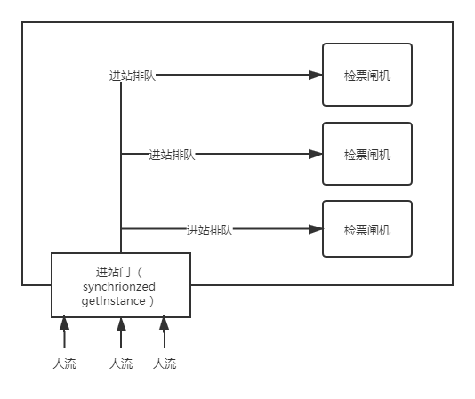

#单例模式
## 8.1.1 单例模式概述
单例模式（Singleton Pattern）指确保任何时候都绝对只有一个实例，并提供一个全局访问点，属于创建性设计模式。

### 8.1.2 应用场景
* J2EE标准中的ServletContext
* ServletContextConfig
* Spring框架中的ApplicationContext
* 数据库中的连接池
---
单例模式主要应用作用于：
1. 需要频繁创建的一些类，减少系统的内存压力，减少GC
2. 某些类创建实例占用资源很多，或实例化耗时长，且经常使用
3. 频繁访问数据库或文件
4. 对于一些控制硬件级别的操作，或者从系统上讲应该是单一控制逻辑的操作，如果有多个实例，系统会出错。

### 8.1.3 单例模式UML图


* Singleton类被称为单例类，通过隐藏构造方法，在内部初始化一次，并提供一个全局访问点。

### 8.1.4 单例模式通用写法(饿汉式)
```java
public class Client {
    public static void main(String[] args) {
        Singleton.getInstance();
    }
    
    static class Singleton{
        private static final Singleton instance = new Singleton();
        
        private Singleton(){}
        
        public static Singleton getInstance(){
            return instance;
        }
    }
}
```

## 8.2 使用单例模式解决实际问题
### 8.2.1 饿汉式单例的优劣
饿汉式单例在类加载的时候就立即初始化，并且创建单例对象。它是绝对线程安全，在线程还没有访问的时候就已经实例化了，绝不可能存在访问安全问题。
另一种写法:
```java
public class HungryStaticSingleton {
    private static final HungryStaticSingleton hungrySingle;
    static {
        hungrySingle = new HungryStaticSingleton();
    }
    private HungryStaticSingleton(){}
    
    public static HungryStaticSingleton getInstance(){
        return hungrySingle;
    }
}
```
* 饿汉式单例使用于单例对象较少的情况，这样写可以保证绝对线程安全，执行效率比较高。
* 缺点是所有对象在加载的时候就初始化了，占用内存高。

### 8.2.2 懒汉时单例的优劣
懒汉式单例
```Java
public class LazySimpleSingleton {
    private LazySimpleSingleton(){}

    //静态块，公共内存区域
    private static LazySimpleSingleton lazySimpleSingleton = null;
    public static LazySimpleSingleton getInstance(){
        if (lazySimpleSingleton == null){
            lazySimpleSingleton = new LazySimpleSingleton();
        }
        return lazySimpleSingleton;
    }
}
```
导致两种结果：

结果一致



结果不一致



* 所以懒汉时显然存在线程安全隐患，如果两个线程在同一时间进入getInstance方法，那么会同时满足if(instance==null)条件，那么会创造两个对象，两个线程都向下执行代码，那么可能后执行的县城结果覆盖先执行的线程结果。如果打印动作在覆盖之前，那么结果一支，如果打印动作在覆盖之后则结果不一致。
* 一般通过getInstance方法加synchronized来解决。

### 8.2.3 双重检查锁单例写法
* 思考：在使用synchronized监视锁的方法来解决线程安全问题的同时会在有大量的线程数量时导致大批量的线程阻塞。从而导致程序性能下降。

  

* 

* 解决：双重检查锁，先让其进入程序，再检查一次。


```java
public class LazyDoubleCheckSingleton {
    private volatile static LazyDoubleCheckSingleton instance;
    private LazyDoubleCheckSingleton(){}

    public static LazyDoubleCheckSingleton getInstance(){
        //检查是否要阻塞
            if(instance == null){
                synchronized (LazyDoubleCheckSingleton.class){
                    //检查是否要重新创建实例
                    if (instance==null) {
                        instance = new LazyDoubleCheckSingleton();
                    }
                }
            }
            return instance;
    }
}
```
* 当第一个线程调用getInstance方法时，第二个线程也可以调用。当第一个线程执行synchronized时会上锁，第二个县城会变成MONITOR状态，出现阻塞。此时，阻塞并不是给予整个LazyDoubleCheckSingleton类的阻塞。而是在getIntance()方案内部的阻塞。

### 8.2.4 静态内部类单例写法

```java
//兼顾饿汉式单例的写法的内存浪费和synchronized的性能问题，完美规避这两种缺点
public class LazyStaticInnerClassSingleton {
    //使用LazyInnerClassGeneral的时候，默认会先初始化内部类
    //如果没有使用，则内部类是不会加载的
    private LazyStaticInnerClassSingleton(){}
    
    //Static 是为了使单例模式的空间共享，保证这个方法不会被重写、重载
    private static LazyStaticInnerClassSingleton getInstance(){
        return LazyHodler.INSTANCE;
    }
    
    //利用Java本身的语法特点，默认不加载内部类
    private static class LazyHodler{

        public static final LazyStaticInnerClassSingleton INSTANCE = new LazyStaticInnerClassSingleton();
    }
}
```
解决了饿汉式单例的内存浪费问题和synchronized的性能问题。内部类一定要在方法调用钱被初始化，巧妙避免了线程安全问题。

### 8.2.5 破坏静态单例模式
```java
public class LazyInnerTest {
    @Test
    public static void main(String[] args) {
        try {
            //如果有人恶意用反射破坏
            Class<?> clazz = LazyStaticInnerClassSingleton.class;

            //通过反射获取私有的构造方法
            Constructor constructor = clazz.getDeclaredConstructor(null);
            //强制访问
            constructor.setAccessible(true);

            //暴力初始化
            Object o1 = constructor.newInstance();

            //调用两次构造方法，相当于new了两次
            Object o2 = constructor.newInstance();
            System.out.println(o1==o2);
        }catch (Exception e){
            e.printStackTrace();
        }

    }
}

```
* 内存中将创近啊两个不同的实例，因此需要做一些优化防止出现多次重复创建。
```java
//兼顾饿汉式单例的写法的内存浪费和synchronized的性能问题，完美规避这两种缺点
public class LazyStaticInnerClassSingleton {
    //使用LazyInnerClassGeneral的时候，默认会先初始化内部类
    //如果没有使用，则内部类是不会加载的
    private LazyStaticInnerClassSingleton(){
        if (LazyHodler.INSTANCE != null){
            throw new RuntimeException("不允许创建多个实例");
        }
    }

    //Static 是为了使单例模式的空间共享，保证这个方法不会被重写、重载
    private static LazyStaticInnerClassSingleton getInstance(){
        //在返回结果前一定会加载内部类
        return LazyHodler.INSTANCE;
    }

    //利用Java本身的语法特点，默认不加载内部类
    private static class LazyHodler{

        public static final LazyStaticInnerClassSingleton INSTANCE = new LazyStaticInnerClassSingleton();
    }
}

```